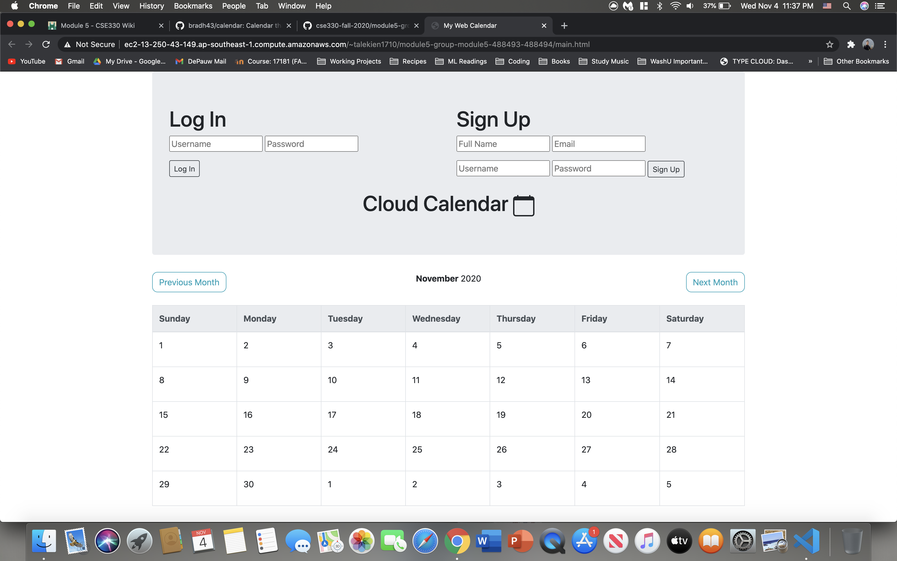
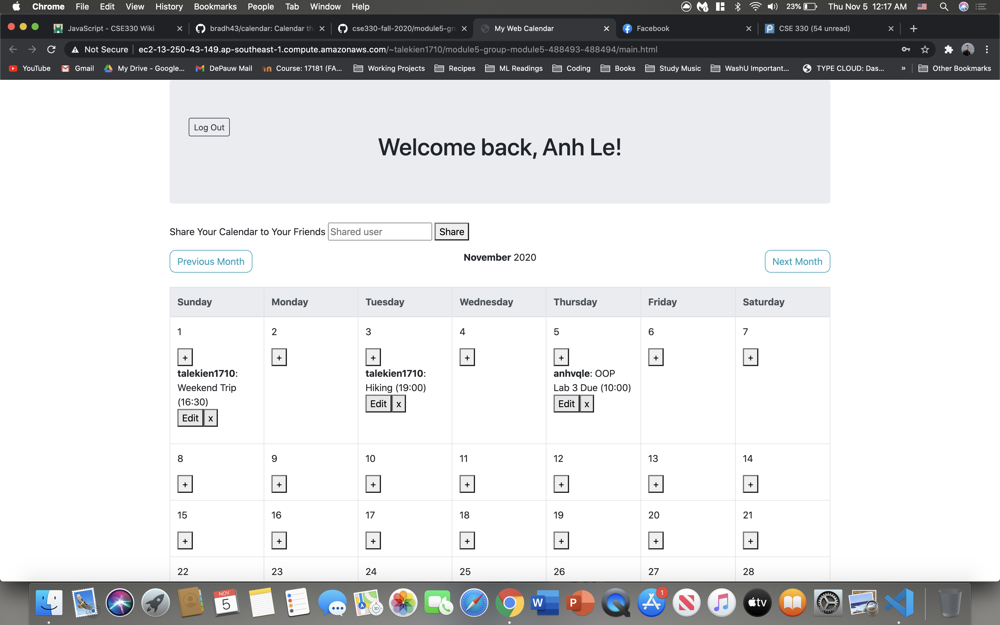

# CSE330
488493

488494

Link to Our Calendar:
http://ec2-13-250-43-149.ap-southeast-1.compute.amazonaws.com/~talekien1710/module5-group-module5-488493-488494/main.html

# Creative portion:

## 1. Calendar Sharing
Users have the option to share all their private events to their additional desired users. Those shared users are able to see all events associated 
to the "owner" user. After sharing the event, the shared users have the right to adjust all events of owmer.

## 2. Group Event
- Users can create group events that display on multiple users calendars. Once the event is shared, all participants have the right to edit/delete the event.
Input the event participants separated by commas, for example: david, kien, anhle

## 3. Password validation:
The password users register for must contain the following:
- A lowercase letter
- An uppercase letter
- A number
- Minimum 8 characters

# Registered users:
talekien1710  
Kien1234

anhvqle  
helloVN84

# Demo:
Before:

After:

